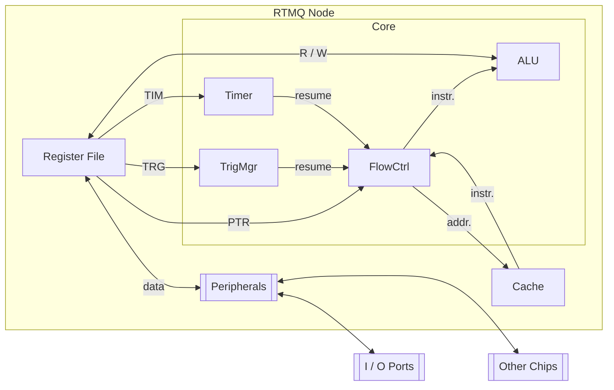
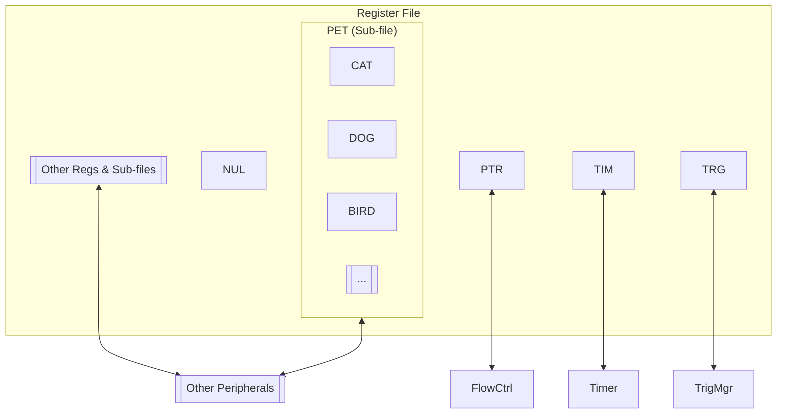
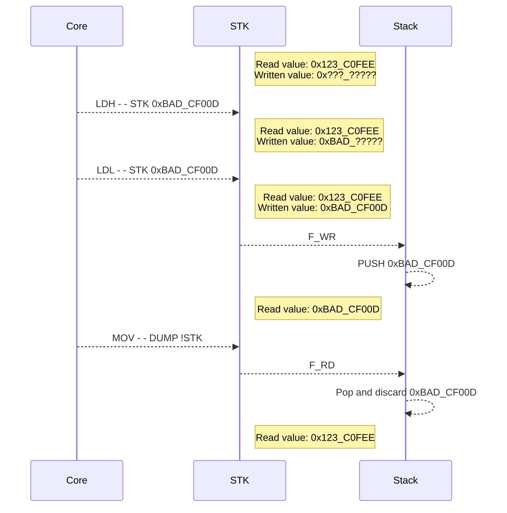
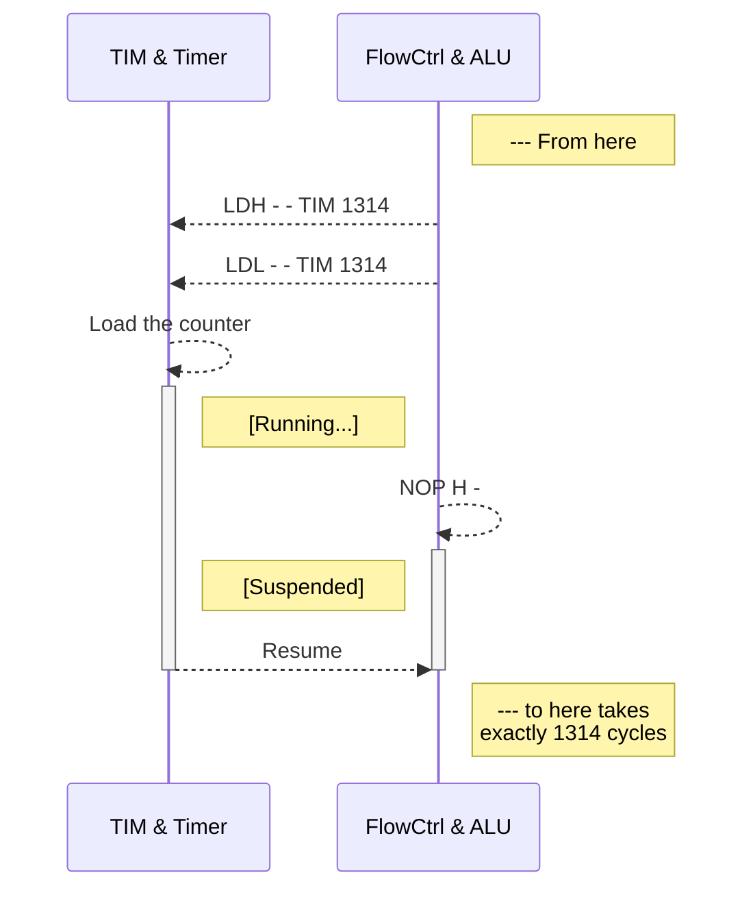

# RTMQ Developer's Guide - Instruction Set & System Architecture

Author: Zhang Junhua

<zhangjh6@sustech.edu.cn>

Rev.0.1 - 2023.12.25

## Introduction

RTMQ (Real-Time Microsystem for Quantum physics) is a SoC (System-on-Chip) framework for quantum experiment control and other scenarios with nano-second timing precision requirements. The framework includes dedicated instruction set, micro-architecture and networking protocol, all to fulfill one goal: integrating scalability and flexibility with precise timing.

The design philosophy of RTMQ framework is that, "*computation is part of the timing sequence*". Instead of a host running software to generate timing sequences and sending triggers here and there, the programs run by the RTMQ core by themselves have well defined timing. So not only triggers and flags, the data flow in the framework is also precisely timed.

## Instruction Set

In the framework, all the operations are treated as data flow, and data flow as register access. Hence all the instructions in the set are register write instructions (flow control and memory load / store are also implemented as register access).

There are 2 types of instructions: *Type-I* and *Type-A*. A *Type-I* instruction loads immediate data stored in the instruction to the destination register, while a *Type-A* instruction involves operation between registers. The opcodes are designed such that most common control tricks and bit hacks can be done with one or few instructions. Since we are talking about nano-second timing precision, you don't want to use too many walk-arounds to do some bit flipping.

### Syntax of Type-I Instruction

The syntax of Type-I instruction is `OPC H F RD imm`.

- `OPC` is the opcode of the instruction, which can be:
  - `LDH`: loads bits 31-20 of the destination register with the immediate data.
  - `LDL`: loads bits 19-0 of the destination register with the immediate data.
  - `SEL`: select a register in a register sub-file (explained in the architecture part).
- `H` is the hold flag, which can be:
  - `H`: instructs the core to hold and wait for resume flag.
  - `-`: do nothing.
- `F` is the flow control flag, which can be:
  - `F`: instructs the core to flush the instruction fetch pipeline and fill it with `NOP`s.
  - `-`: do nothing.
- `RD` is the destination register name.
- `imm` is the immediate data, a 32-bit integer.

**CONVENTION-1:** For `LDL`, bits 31-20 are not actually encoded in the machine code, and the same with bits 19-0 for `LDH`. However for better readability, the 32-bit immediate data should appear as a whole in the assembly instructions. For example,

```RTMQ
LDH - -  RD  0x5A4_00000
LDL - -  RD  0x000_C5859
```

will load value `0x5A4_C5859` to register `RD`, but obviously,

```RTMQ
LDH - -  RD  0x5A4_C5859
LDL - -  RD  0x5A4_C5859
```

looks much better.

**CONVENTION-2:** If an entire 32-bit immediate data is to be loaded to a register, always use `LDH` first, and then `LDL`.

### Syntax of Type-A Instruction

The syntax of Type-A instruction is `OPC H F [!]RD [!]R0 [!]R1`.

- `OPC` is the opcode, which determines the operation to be done (see the tables below).
- `H` is the hold flag, same as in Type-I instructions.
- `F` is the flow control flag, same as in Type-I instructions.
- `RD` is the destination register name.
- `R0` and `R1` are operands of the instruction. Each can either be a register name, or a 7-bit immediate data.
- `!` is an optional inversion prefix that can be applied to register names. The effect depends on the opcode.

### Labels and Comments

A label marks an address in the code, that can be used as jump target, which:

- occupies 1 line,
- starts with `#` and ends with `:`,
- contains only alphanumerical characters and underscores,
- can be used in the code as immediate data, with `:` removed when referenced.

A comment starts with `%`. It can occupy 1 line, or be appended at the end of an instruction (not a label!).

Here is an example for both:

```RTMQ
#Jump_2_here:
LDH - -  TIM  123
LDL - -  TIM  123
......
% do whatever fancy stuff (this is a comment)
......
LDH - -  PTR  #Jump_2_here
LDL - -  PTR  #Jump_2_here  % Let's JUMP!
```

### Opcodes of Type-A Instruction

Depending on opcodes, `R0` and `R1` can be treated as *arithmetic* values or *logic* values.

- Arithmetic values
  - Immediate data is interpreted as a 7-bit signed integer, and is sign-extended to 32-bit.
  - Register inversion is implemented as arithmetic negation.
- Logic values
  - Immediate data is given in `nibb.pos` notation, with 4 bits of nibble data and 3 bits of nibble position, and is evaluated as `nibb << (pos * 4)`. For example, `0xA.5` yields `0x00A_00000`, and `0x3.2` yields `0x000_00300`.
  - Register inversion is implemented as bitwise inversion.

In the tables below, details of all the opcodes are presented. The following labels will appear in the tables to indicate the types of the operands and the results:

- *Ath*: arithmetic value
- *Log*: logic value
- *Spe*: special inversion effect
- *N/A*: inversion not applicable

In the first 3 columns, a `!` denotes that an inversion prefix is applied to the corresponding operand or `RD`. And the *Operation* column presents the overall effect of the opcode including the inversions. Moreover, `R*[i]` denotes the i-th bit of `RD` / `R0` / `R1`, where `i` runs from 31 to 0. And `cond ? Vt : Vf` is the ternary operator, which yields `Vt` if `cond` evaluates to `True`, otherwise yields `Vf`.

#### Arithmetic / Logic Opcodes

`ADD`: arithmetic addition

| `R0`: *Ath* | `R1`: *Ath* | `RD`: *N/A* | Operation
|:-----------:|:-----------:|:-----------:|:---------
|             |             |             | `RD = R0 + R1`
|             |      !      |             | `RD = R0 - R1`
|      !      |             |             | `RD = -R0 + R1`
|      !      |      !      |             | `RD = -R0 - R1`

`AND`: bitwise and

| `R0`: *Log* | `R1`: *Log* | `RD`: *Log* | Operation
|:-----------:|:-----------:|:-----------:|:---------
|             |             |             | `RD = R0 and R1`
|             |             |      !      | `RD = not (R0 and R1)`
|             |      !      |             | `RD = R0 and (not R1)`
|             |      !      |      !      | `RD = (not R0) or R1`
|      !      |             |             | `RD = (not R0) and R1`
|      !      |             |      !      | `RD = R0 or (not R1)`
|      !      |      !      |             | `RD = not (R0 or R1)`
|      !      |      !      |      !      | `RD = R0 or R1`

`XOR`: bitwise exclusive-or

| `R0`: *Log* | `R1`: *Log* | `RD`: *N/A* | Operation
|:-----------:|:-----------:|:-----------:|:---------
|             |             |             | `RD = R0 xor R1`
|             |      !      |             | `RD = not (R0 xor R1)`
|      !      |             |             | `RD = not (R0 xor R1)`
|      !      |      !      |             | `RD = R0 xor R1`

#### Comparison Opcodes

`CLU`: unsigned compare

**NOTE:** `R0` and `R1` are treated as unsigned numbers when compared.

| `R0`: *Ath* | `R1`: *Ath* | `RD`: *Log* | Operation
|:-----------:|:-----------:|:-----------:|:---------
|             |             |             | `RD = (R0 < R1) ? 0xFFF_FFFFF : 0`
|             |             |      !      | `RD = (R0 >= R1) ? 0xFFF_FFFFF : 0`
|             |      !      |             | `RD = (R0 + R1 < 0x1_000_00000) ? 0xFFF_FFFFF : 0`
|             |      !      |      !      | `RD = (R0 + R1 >= 0x1_000_00000) ? 0xFFF_FFFFF : 0`
|      !      |             |             | `RD = (R0 + R1 > 0x1_000_00000) ? 0xFFF_FFFFF : 0`
|      !      |             |      !      | `RD = (R0 + R1 <= 0x1_000_00000) ? 0xFFF_FFFFF : 0`
|      !      |      !      |             | `RD = (R0 > R1) ? 0xFFF_FFFFF : 0`
|      !      |      !      |      !      | `RD = (R0 <= R1) ? 0xFFF_FFFFF : 0`

`CLS`: signed compare

| `R0`: *Ath* | `R1`: *Ath* | `RD`: *Log* | Operation
|:-----------:|:-----------:|:-----------:|:---------
|             |             |             | `RD = (R0 < R1) ? 0xFFF_FFFFF : 0`
|             |             |      !      | `RD = (R0 >= R1) ? 0xFFF_FFFFF : 0`
|             |      !      |             | `RD = (R0 + R1 < 0) ? 0xFFF_FFFFF : 0`
|             |      !      |      !      | `RD = (R0 + R1 >= 0) ? 0xFFF_FFFFF : 0`
|      !      |             |             | `RD = (R0 + R1 > 0) ? 0xFFF_FFFFF : 0`
|      !      |             |      !      | `RD = (R0 + R1 <= 0) ? 0xFFF_FFFFF : 0`
|      !      |      !      |             | `RD = (R0 > R1) ? 0xFFF_FFFFF : 0`
|      !      |      !      |      !      | `RD = (R0 <= R1) ? 0xFFF_FFFFF : 0`

`CEQ`: equal

| `R0`: *Log* | `R1`: *Ath* | `RD`: *Log* | Operation
|:-----------:|:-----------:|:-----------:|:---------
|             |             |             | `RD = (R0 == R1) ? 0xFFF_FFFFF : 0`
|             |             |      !      | `RD = (R0 != R1) ? 0xFFF_FFFFF : 0`
|             |      !      |             | `RD = (R0 + R1 == 0) ? 0xFFF_FFFFF : 0`
|             |      !      |      !      | `RD = (R0 + R1 != 0) ? 0xFFF_FFFFF : 0`
|      !      |             |             | `RD = (not R0 == R1) ? 0xFFF_FFFFF : 0`
|      !      |             |      !      | `RD = (not R0 != R1) ? 0xFFF_FFFFF : 0`
|      !      |      !      |             | `RD = (R0 + 1 == R1) ? 0xFFF_FFFFF : 0`
|      !      |      !      |      !      | `RD = (R0 + 1 != R1) ? 0xFFF_FFFFF : 0`

#### Assignment Opcodes

`SGN`: sign multiply

| `R0`: *Ath* | `R1`: *Ath* | `RD`: *N/A* | Operation
|:-----------:|:-----------:|:-----------:|:---------
|             |             |             | `RD = (R1 < 0) ? -R0 : R0`
|             |      !      |             | `RD = (R1 > 0) ? -R0 : R0`
|      !      |             |             | `RD = (R1 >= 0) ? -R0 : R0`
|      !      |      !      |             | `RD = (R1 <= 0) ? -R0 : R0`

`SNE`: set if negative

| `R0`: *Log* | `R1`: *Ath* | `RD`: *Spe* | Operation
|:-----------:|:-----------:|:-----------:|:---------
|             |             |             | if `R1 < 0` then `RD = R0`
|             |             |      !      | if `R1 >= 0` then `RD = R0`
|             |      !      |             | if `R1 > 0` then `RD = R0`
|             |      !      |      !      | if `R1 <= 0` then `RD = R0`
|      !      |             |             | if `R1 < 0` then `RD = not R0`
|      !      |             |      !      | if `R1 >= 0` then `RD = not R0`
|      !      |      !      |             | if `R1 > 0` then `RD = not R0`
|      !      |      !      |      !      | if `R1 <= 0` then `RD = not R0`

`SMK`: masked set

| `R0`: *Log* | `R1`: *Log* | `RD`: *N/A* | Operation
|:-----------:|:-----------:|:-----------:|:---------
|             |             |             | if `R1[i] == 1` then `RD[i] = R0[i]` for `i` = 31 to 0
|             |      !      |             | if `R1[i] == 0` then `RD[i] = R0[i]` for `i` = 31 to 0
|      !      |             |             | if `R1[i] == 1` then `RD[i] = not R0[i]` for `i` = 31 to 0
|      !      |      !      |             | if `R1[i] == 0` then `RD[i] = not R0[i]` for `i` = 31 to 0

`MOV`: move

`MOV` is a special opcode that it has only one operand - `R1`. And its effect is just as the name suggests, *move* `R1` to `RD`. The reason why it is here will be explained later in the architecture part.

| `R0`: *N/A* | `R1`: *Log* | `RD`: *Spe* | Operation
|:-----------:|:-----------:|:-----------:|:---------
|             |             |             | `RD = R1`
|             |             |      !      | `RD = R1 + 1`
|             |      !      |             | `RD = not R1`
|             |      !      |      !      | `RD = -R1`

#### Shift Opcodes

There are 3 shift opcodes:

- `SLL`: shift left logic
- `SLA`: shift left arithmetic
- `SLC`: shift left cyclic

For all the 3 opcodes:

- `R0` is logic value, and inversion is applied before shift.
- `R1` is arithmetic value. After inversion, positive `R1` yields left shift, while negative `R1` yields right shift.
- Note that after inversion, `R1` should be within -32 ~ 31.
- The inversion effect of `RD` is that the filling bits are bitwise inverted.

The difference of the opcodes lies in the filling bits, and is summarized in the following table.

| Opcode | LSBs filling for left shift  | MSBs filling for right shift |
|:------:|:-----------------------------|:-----------------------------|
| `SLL`  | duplications of `R0[0]`      | `0`s                         |
| `SLA`  | `0`s                         | duplications of `R0[31]`     |
| `SLC`  | shift-out MSBs of `R0`       | shift-out LSBs of `R0`       |

## System Architecture

Since the primary objective of RTMQ framework is to keep everything precisely on time, in most cases the program run by the core is just to send data around, press buttons here and there, or do some primary school arithmetics. Big computation jobs can be easily offloaded to dedicated peripherals, or to a dedicated coprocessor if needed. So, along with the instruction set, the processor core of RTMQ framework also has a light-weight micro-architecture, so that more resources can be allocated to peripheral modules.

### Overview



As illustrated in the above diagram, the entire SoC design that you fit into a single chip (FPGA or ASIC) is called an *RTMQ Node*, and a node contains these modules:

- A *processor core* (currently only 1 for each node).
- Multiple *peripherals*, that implement customized functions like interfaces to other chips or performing dedicated algorithms.
- A *register file*, that serves as a bus between the core and the peripherals.

And the core consists of 4 sub-modules:

- *ALU*: the biggest sub-module in the core, all the instruction decoding and execution happens here. It reads values from the register file, does the operation, and writes the result back.
- *FlowCtrl*: manages instruction fetch and flow control, the `H` and `F` flags are handled here. Jumps and branches are realized by writing to the `PTR` register.
- *Timer*: as the name suggests, do the timing, and generates resume flags to the *FlowCtrl* such that the timing of instruction execution can be aligned. *Timer* is activated by writing to the `TIM` register.
- *TrigMgr*: manages internal and external trigger channels, also generates resume flags. Trigger channels are enabled by writing to the `TRG` register.

### Register File

Many other architectures map the peripherals to the memory address space, of course this is quite convenient, but accessing the memory can take several instructions (depending on the addressing mode, you may have to first prepare the address, then load / store the data), and surely has no bit-addressing capability. So RTMQ framework utilize the registers as the "mailboxes" or "buttons" for the core to communicate with and to control the peripherals. And the register file is just the collection of them:



About the register addressing:

- The register address is 8-bit wide, so there are in total 256 registers that the core can directly write to.
- Due to the limited space in instruction encoding, the operands of Type-A opcodes can only be the first 64 registers (6-bit address), except for `MOV`. The `R1` operand of `MOV` can access the entire address space, and that's why `MOV` exists.
- In case that 256 registers are not enough for some SoC design, registers that are not frequently accessed or whose R/W timing requirements are not harsh, can be organized into sub-files. All the registers in a sub-file have the same address, and `SEL` instruction is used to select one of them, such that it can be accessed later with this address. Take the above diagram as an example, `SEL - -  PET  CAT` selects the register `CAT` in sub-file `PET`. Later if you write a `FISH` to address `PET`, and you may read back a `MEW` (not a `WOOF` or a `CHIRP`).

About the register access:

- When a register is accessed, depending on the type of access, different flags will be asserted:
  - `F_WR_IH`: bits 31-20 are written by a `LDH` instruction.
  - `F_WR_IL`: bits 19-0 are written by a `LDL` instruction.
  - `F_WR_A`: the register is written by a Type-A instruction.
    - **Special for `SNE`:** This flag is asserted only when the register is actually written (the condition evaluates to `True`).
  - `F_WR`: `F_WR_IL` or `F_WR_A`, which indicates that the register now has a brand new value. And that's why `LDH` must appear before `LDL`.
  - `F_RD`: the register is an operand of a Type-A instruction.
  - **NOTE:** Registers in a sub-file each has its own set of access flags, only the flags of the register selected by `SEL` will be asserted.
- The peripheral that this register corresponds to may use any of these flags as triggers of different functions (while in most cases only `F_RD` and `F_WR` are used). And this feature is important in RTMQ framework because:
  - The timing of instruction execution is precisely scheduled.
  - Instructions access registers and assert access flags.
  - Functions of the peripherals are triggered by the flags.
  - Hence the timing of peripheral functions are precisely scheduled.
- Since the register is just an interface between the core and the peripheral, its written value and its read values doesn't necessarily be the same. However, the written value does exist somewhere in the chip. For `SNE` instructions, if the write operation doesn't actually take place, the register just keeps the previously written value. Similar for `SMK` instructions, only the masked bits are written, other bits just hold the old values.

About the null register `NUL`:

- Its address is 0.
- The read value is 0, and writing to it has no effect.
- The `NOP H F` pseudo instruction is implemented as `LDH H F  NUL  0`.

Note that only `NUL`, `PTR`, `TIM` and `TRG` are mandatory, all others are optional. Depending on the purpose of a design, you may add other peripherals and registers. Some common choices are:

- Exception management
- R / W access to the instruction cache
- A data cache
- Some stacks
- Some general purpose registers

### Peripherals

The peripherals are modules customized by SoC designers to implement dedicated functions, like a UART transceiver or a 64-point FFT module. Peripherals respond to register access flags with designated operations. For example, a typical stack with register `STK` as its interface, interacts with the core as follows:



When `STK` is written by the core with `LDH` and then `LDL` instruction, flag `F_WR` is asserted to trigger a push operation. Then the read value of `STK` is updated to the new top element. Later when `STK` is read by the core with `MOV` instruction, flag `F_RD` is asserted to notify the stack to pop and discard the top element (since it's already read), and the read value of `STK` is restored to its previous value.

You may notice that RTMQ framework has no hardware interrupt mechanism for peripherals. That's for the sake of deterministic timing, since interrupts are unpredictable events. Instead, you may implement software interrupt by checking some registers at appropriate time to see if anything needs attention.

### Core: ALU

The *ALU* sub-module in the core decodes and executes the instructions issued by the FlowCtrl sub-module. Type-I and Type-A instructions take different paths in the *ALU*. Currently Type-A instruction has 5 stages in its pipeline, while Type-I instruction only has 2 stages. Which is, you have to wait 4 clock cycles before the new value of a Type-A instruction is available, and 1 cycle for Type-I instruction. For example:

```RTMQ
MOV - -  FOO  BAM          % FOO assigned
LDH - -  BAR  0x123_45678
LDL - -  BAR  0x123_45678  % BAR assigned
NOP - -
XOR - -  BEE  BAR  0xA.2   % BAR available
ADD - -  BAZ  FOO  0x12    % FOO available
```

**Special for `SNE` and `SMK`:** The conditional / masked assignment happens on the register side, in other words, in the last stage of the pipeline. So you don't need to wait for the new value before `SNE` and `SMK`. Something like this works correctly:

```RTMQ
LDH - -  FOO  0xBAA_B00FF
LDL - -  FOO  0xBAA_B00FF
NOP - -
XOR - -  FOO  FOO  0xA.3    % FOO is going to be 0xBAA_BA0FF
SMK - -  FOO  0xA.2 !NUL    % FOO is going to be 0x000_00A00
NOP - -
NOP - -
NOP - -
MOV - -  BAR  FOO           % BAR gets 0xBAA_BA0FF
MOV - -  BAZ  FOO           % BAZ gets 0x000_00A00
```

**NOTE:** The 2 pipelines will collide if both Type-A and Type-I instructions try to write to the same register at the same clock cycle. This is an undefined behavior and should be avoided. For example:

```RTMQ
MOV - -  BAZ  BAM          % Type-A assignment to BAZ
NOP - -
LDH - -  BAZ  0xBEE_F100D
LDL - -  BAZ  0xBEE_F100D  % Type-I assignment to BAZ
NOP - -
NOP - -                    % Collision happens here, the value of BAZ is undefined
```

### Core: FlowCtrl

The *FlowCtrl* sub-module handles the instruction fetch and the running state of the core. When `H` flag is encountered in an instruction, the *FlowCtrl* suspends the instruction fetch pipeline and wait for resume flags from the *Timer* module and the *TrigMgr* module, such that the next instruction is executed in alignment with designated timing or trigger event. Note that:

- Current instruction (the one with `H` flag) is still issued to the *ALU*. It's the fetch of the next instruction that is suspended.
- `H` flag only suspends the instruction fetch pipeline, everything else, including the *ALU*, is still running.
- If a resume flag is present but the core is not in suspension, the resume flag will remain until a `H` flag is encountered in an instruction.

When `F` flag is encountered in an instruction, the *FlowCtrl* flushes the instruction fetch pipeline and fill it with `NOP - -` until next valid instruction is loaded.

The interface register for *FlowCtrl* is `PTR`, from which you can read the address of the current instruction, so that relative jump can be performed, or return point can be saved before calling a subroutine. Writing to `PTR` initiates a jump to the written address, and conditional jump can be performed with `SNE`. Note that you should always assert `F` flag when writing to `PTR` register.

These behaviors are undefined, their outcomes depend on the detailed implementation of the core:

- Writing to `PTR` without asserting `F` flag
- Asserting `F` flag when writing to a register other than `PTR`
- Writing to `PTR` with `SMK` instruction

### Core: Timer

The *Timer* sub-module schedules the timing of instruction execution by asserting resume flags to the *FlowCtrl*. The interface register is `TIM`. When the `F_WR` flag of `TIM` is asserted, the *Timer* loads the written value of `TIM` to a counter and starts counting down. A resume flag is asserted when the counter reaches 0.

The *Timer* is designed such that this code structure takes exactly `$dur` clock cycles:

```RTMQ
LDH - -  TIM  $dur
LDL - -  TIM  $dur
......
......
NOP H -
```

**NOTE:** This `$` notation is used only in the guides, to literally represent constants that you can replace with appropriate values.

And this code structure takes exact number of clock cycles as defined in register `DUR`:

```RTMQ
NOP - -
MOV - -  TIM  DUR
......
......
NOP H -
```

As illustrated:



Of course, only when the designated interval is long enough to execute the instructions in `......`. Otherwise, the core will keep running until `NOP H -` is encountered, be suspended and then immediately released by the already asserted resume flag.

These 2 structures are named *timed task*. They are the primary building blocks of the timing sequences. The idea is that:

- The timing critical instructions (like, writing to some output register) can be arranged with designated intervals.
- While in between, general computation and flow control can be performed.
- When everything is done, just sit and wait for the *Timer* to expire.

When generating timing sequences, a more convenient form of *timed task* would be:

```RTMQ
......
NOP H -
LDH - -  TIM  $dur
LDL - -  TIM  $dur
......
```

and

```RTMQ
......
NOP H -
NOP - -
MOV - -  TIM  dur
......
```

Intuitively, it means "*wait for the last, then start the next*".

### Core: TrigMgr

Similar to the *Timer*, the *TrigMgr* aligns the timing of instruction execution to trigger events. The interface register is `TRG`, and each bit of which corresponds to a trigger channel. When `F_WR` of `TRG` is asserted, the *TrigMgr* is activated, and the enabled channels (with bits in `TRG` set to `1`) start waiting for triggers. When all the enabled channels are triggered, a resume flag is asserted. Then the *TrigMgr* is deactivated and later trigger events are ignored.

In this way, the timed task blocks can be aligned to trigger events:

```RTMQ
......              % Last timed task

NOP H -             % ┐
LDH - -  TRG  $trg  % ├ Insert this right before a timed task
LDL - -  TRG  $trg  % ┘

% No instructions in between, for precise alignment

NOP H -             % ┐
LDH - -  TIM  $dur  % ├ Header of the next timed task, aligned to the trigger event
LDL - -  TIM  $dur  % ┘

......              % Next timed task
```

If you just assign a `0x000_00000` to `TRG`, the *TrigMgr* will instantly assert a resume flag. This feature can be used if you just want the job done and don't care about the timing. So the header of an *untimed task* is as follows:

```RTMQ
......
NOP H -
MOV - -  TRG  NUL
......
```

**NOTE:** When all the jobs are done, the sequence should end with 2 `NOP H -` instructions. The first one concludes the last timed / untimed task block, and the second one holds the core indefinitely.

## Examples

### Blinking LED

This example implements a blinking LED with on / off each `$dur` clock cycles.

```RTMQ
MOV - -  TRG  NUL    % Generate a resume flag to compensate the first H flag
MOV - -  LED  NUL    % Initialize the LED state
#LOOP:
NOP H -              % ┐
LDH - -  TIM  $dur   % ├ Start of the timed task
LDL - -  TIM  $dur   % ┘
MOV - -  LED !LED    % Switch the LED state
LDL F -  PTR  #LOOP  % Loop indefinitely
```

### UART Transmitter

This example implements a software UART transmitter that wrap and send the least significant byte of register `DAT`, with 2 stop bits. Each baud lasts `$baud` clock cycles. Suppose `TX` is the output register and bit 0 is the channel we want to use.

```RTMQ
% --- Initialization ---
LDH - -  DAT  $byte
LDL - -  DAT  $byte         % Prepare the data we want to send
MOV - -  TX  !NUL           % Set all Tx channels to idle

% --- Wrap the byte ---
MOV - -  BUF  DAT           % Load the data to the buffer
SMK - -  BUF  0x3.2  0x3.2  % Put the stop bits
LDH - -  CNT  11
LDL - -  CNT  11            % Set up the bit counter, 2 + 8 + 1 = 11
MOV - -  TRG  NUL           % Generate a resume flag
NOP - -
SLA - -  BUF  BUF  1        % Put the start bit

% --- Transmit loop ---
#LOOP:
NOP H -                     % ┐
LDH - -  TIM  $baud         % ├ Start of the timed task to send a bit
LDL - -  TIM  $baud         % ┘
ADD - -  CNT  CNT  -1       % Decrease the bit counter
LDH - -  TMP  #LOOP
LDL - -  TMP  #LOOP         % Use a temp register to store the label
SMK - -  TX   BUF  0x1.0    % Send the LSB of BUF
SLA - -  BUF  BUF  -1       % Shift right 1 bit
SNE - F  PTR  TMP !CNT      % Loop if CNT > 0

% --- Halt ---
NOP H -                     % Conclude the last timed task
NOP H -                     % Halt
```

### UART Receiver

This example implements a software UART receiver that receives 1 byte data, with 2 stop bits. Each baud lasts `$baud` clock cycles. Suppose `RX` is the input register and bit 0 is the channel we want to sample. `RX[0]` is also connected to the trigger channel 0 with negative edge sensitivity for start bit detection, which can be enabled by asserting `TRG[0]`.

```RTMQ
% --- Initialization ---
LDH - -  TMP  $baud
LDL - -  TMP  $baud
ADD H -  TRG  NUL  1        % Arm the trigger and wait for the start bit
SLA - -  TIM  TMP  -1       % Wait for half a baud
ADD - -  CNT  NUL  11       % Set up the bit counter, 2 + 8 + 1 = 11

% --- Sampling loop ---
#LOOP:
NOP H -                     % ┐
LDH - -  TIM  $baud         % ├ Start of the timed task to sample a bit
LDL - -  TIM  $baud         % ┘
ADD - -  CNT  CNT  -1       % Decrease the bit counter
SLC - -  BUF  BUF  -1       % Shift right 1 bit, since UART is LSB first
SMK - -  BUF  RX  0x1.0     % Sample the channel
LDH - -  TMP  #LOOP
LDL - -  TMP  #LOOP         % Use a temp register to store the label
SNE - F  PTR  TMP !CNT      % Loop if CNT > 0

% --- Finalization ---
LDH - -  TMP  0xFF
LDL - -  TMP  0xFF          % Set up the bit mask
SLC - -  BUF  BUF  9        % Shift back the received data
SMK - -  BUF  NUL !TMP      % Mask out all but the data bits
NOP H -                     % Conclude the last timed task
NOP H -                     % Halt
```
